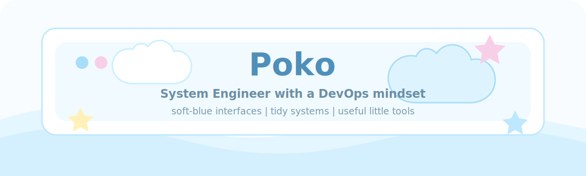

  

  
  
  

<h3 align="center">Soft-blue systems, tidy DevOps notes, and cozy little web spaces.</h3>

  System Engineer mindset | DevOps practice | PokoOS-style interfaces

  

---

<table>
  <tr>
    <td width="58%" valign="top">
      <h3>Poko's tiny profile.txt</h3>
      <pre><code>name        Poko
theme       Pastel Light Blue
focus       System Engineering, DevOps, and web experiences
style       soft visuals, tidy systems, calm details
currently   building PokoOS-style portfolio experiments
mood        gentle, useful, and a little playful</code></pre>
    </td>
    <td width="42%" valign="top">
      <h3>Soft Notes</h3>
      
I like turning technical things into spaces that feel clear, calm, and friendly.

      
My favorite kind of project has clean structure, useful automation, and a visual style that feels light enough to breathe.

    </td>
  </tr>
</table>

---

<h3 align="center">Tiny Toolbox</h3>

  
  
  
  
  
  
  
  
  
  
  
  

  

---

<h3 align="center">Project Shelf</h3>

<table>
  <tr>
    <td width="50%" valign="top">
      <h3><a href="https://github.com/pokomiko/pokoprofile">PokoProfile</a></h3>
      
A pastel-blue PokoOS portfolio with a boot screen, terminal app, gallery, and liquid-glass windows.

      
<code>Nuxt 3</code> <code>Vue</code> <code>Portfolio</code> <code>Pastel UI</code>

    </td>
    <td width="50%" valign="top">
      <h3><a href="https://github.com/pokomiko/cloud-native-boilerplate">Cloud Native Boilerplate</a></h3>
      
A clean starting point for cloud-native experiments and deployment practice.

      
<code>Cloud Native</code> <code>DevOps</code> <code>Boilerplate</code>

    </td>
  </tr>
</table>

---

<h3 align="center">GitHub Garden</h3>

<table>
  <tr>
    <td width="33%" valign="top">
      <h4>Now growing</h4>
      
Portfolio polish, PokoOS ideas, and cleaner developer workflows.

    </td>
    <td width="33%" valign="top">
      <h4>Favorite stack</h4>
      
Nuxt, Vue, TypeScript, Linux, containers, and calm dashboard-like interfaces.

    </td>
    <td width="33%" valign="top">
      <h4>Design mood</h4>
      
Pastel light blue, soft contrast, compact details, and friendly system vibes.

    </td>
  </tr>
</table>

  <a href="https://github.com/pokomiko?tab=repositories">Browse repositories</a>
  |
  <a href="https://github.com/pokomiko/pokoprofile">Visit PokoProfile</a>
  |
  <a href="https://github.com/pokomiko/cloud-native-boilerplate">Open Cloud Native Boilerplate</a>

  

